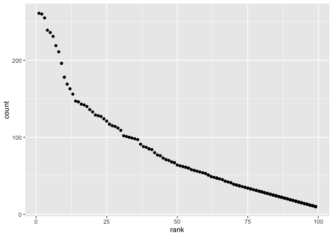

p8105\_hw2\_cm4070
================

## Problem 1

### Read and clean `Mr. Trash Wheel` dataset

``` r
mrtrashwheel_data = 
  read_excel("./data/Trash-Wheel-Data.xlsx", 1, range = "A2:N535") %>%
  janitor::clean_names() %>%
  drop_na() %>%
  mutate(
  sports_balls = as.integer(sports_balls)) 
```

### Read and clean `Precipitation` datasets

``` r
precipitation2018_data = 
  read_excel("./data/Trash-Wheel-Data.xlsx", 7, range = "A2:B14") %>%
  janitor::clean_names() %>%
  drop_na() %>%
  mutate(year = "2018")
```

``` r
precipitation2019_data =
  read_excel("./data/Trash-Wheel-Data.xlsx", 6, range = "A2:B14") %>%
  janitor::clean_names() %>%
  drop_na() %>%
  mutate(year = "2019")
```

### Combine 2018 and 2019 `Precipitation` datasets

``` r
precipitation_data = 
  bind_rows(precipitation2018_data, precipitation2019_data) %>%
  mutate(
    month = month.name[month]
  )
```

### Describe these data

There are 453 observations in `mrtrashwheel_data` and key variables are
dumpster, month, year, date, weight\_tons, volume\_cubic\_yards,
plastic\_bottles, polystyrene, cigarette\_butts, glass\_bottles,
grocery\_bags, chip\_bags, sports\_balls, homes\_powered. There are 24
observations in `precipitation_data` and key variables are month, total,
year. The total precipitation in 2018 was 70.33 inches. The median
sports balls in 2019 was 9.

## Problem 2

### Read and Clean `pols-month` dataset

``` r
pols_data = 
  read_csv("./data/pols-month.csv") %>% 
  janitor::clean_names() %>%
  separate(mon, into = c("year", "month", "day")) %>%
  mutate(month = as.numeric(month)) %>%
  mutate(month = month.abb[month]) %>%
  unite('president', prez_dem,prez_gop, sep = "") %>%
  mutate(president = as.numeric(president)) %>%
  mutate(president = recode(president, '10' = 'dem', '01' = 'gop')) %>%
  mutate(month = str_to_lower(month)) %>%
  select(-day)
```

    ## Rows: 822 Columns: 9

    ## ── Column specification ────────────────────────────────────────────────────────
    ## Delimiter: ","
    ## dbl  (8): prez_gop, gov_gop, sen_gop, rep_gop, prez_dem, gov_dem, sen_dem, r...
    ## date (1): mon

    ## 
    ## ℹ Use `spec()` to retrieve the full column specification for this data.
    ## ℹ Specify the column types or set `show_col_types = FALSE` to quiet this message.

### Read and Clean `snp` dataset

``` r
snp_data = 
  read_csv(file = "./data/snp.csv") %>%
  janitor::clean_names() %>%
  separate(date, into = c("year", "month", "day")) %>%
  mutate(month = as.numeric(month)) %>%
  mutate(month = month.abb[month]) %>%
  mutate(month = str_to_lower(month)) %>%
  select(-day)
```

    ## Rows: 787 Columns: 2

    ## ── Column specification ────────────────────────────────────────────────────────
    ## Delimiter: ","
    ## chr (1): date
    ## dbl (1): close

    ## 
    ## ℹ Use `spec()` to retrieve the full column specification for this data.
    ## ℹ Specify the column types or set `show_col_types = FALSE` to quiet this message.

### Read and Clean `unemployment` dataset

``` r
unemployment_data = 
  read_csv("./data/unemployment.csv") %>%
  janitor::clean_names() %>%
  pivot_longer(
    jan:dec, 
    names_to = "month", 
    values_to = "unemployment") %>%
  mutate(year = as.character(year))
```

    ## Rows: 68 Columns: 13

    ## ── Column specification ────────────────────────────────────────────────────────
    ## Delimiter: ","
    ## dbl (13): Year, Jan, Feb, Mar, Apr, May, Jun, Jul, Aug, Sep, Oct, Nov, Dec

    ## 
    ## ℹ Use `spec()` to retrieve the full column specification for this data.
    ## ℹ Specify the column types or set `show_col_types = FALSE` to quiet this message.

### Join `snp` into `pols` datasets then `unemployment`

``` r
snppols_data = 
  left_join(pols_data, snp_data, by = "year")

conjoinedunemployment_data = 
  left_join(unemployment_data, snppols_data, by = "year")
```

### Describe these data

The `pols_data` dataset contained poll data from 822 observations and
year, month, president, gov\_gop, sen\_gop, rep\_gop, gov\_dem,
sen\_dem, rep\_dem variables. The `snp_data` dataset contained 787
observations and year, month, close variables. The `unemployment_data`
dataset contained 816 observations and year, month, unemployment
variables. The `conjoinedunemployment_data` dataset contained 9720
observations and year, month, unemployment, month.x, president,
gov\_gop, sen\_gop, rep\_gop, gov\_dem, sen\_dem, rep\_dem, month.y,
close variables. Therefore it included all variables within each
dataset, but combined year through joining.

## Problem 3

### Load and tidy `popular_baby_names` dataset

``` r
babynames_data = read.csv("./data/Popular_Baby_Names.csv") %>% 
  janitor::clean_names() %>% 
  mutate(
    child_s_first_name = 
    str_to_lower(child_s_first_name)) %>% 
  mutate(gender = str_to_lower(gender)) %>% 
  mutate(ethnicity = str_to_lower(ethnicity)) %>% 
  relocate(child_s_first_name) %>%
  distinct(.keep_all = TRUE)
```

### Make a table for “Olivia” name

``` r
olivia_table = 
  filter(babynames_data, child_s_first_name == "olivia", gender == "female") %>%
  select(-child_s_first_name, -gender, -count) %>%
  pivot_wider(names_from = "year_of_birth",
              values_from = "rank") %>%
  relocate(
    "ethnicity", "2011", "2012", "2013", "2014", 
    "2015", "2016")
```

## Make a table for Male’s most popular name

``` r
male_table = 
  filter(babynames_data, gender == "male") %>%
  select(-gender, -count) %>%
  pivot_wider(names_from = "year_of_birth",
              values_from = "child_s_first_name") %>%
  relocate(
    "ethnicity", "rank", "2011", "2012", "2013", 
    "2014", "2015", "2016") 
```

## Make a plot

*This code creates a scatterplot showing the number of male, non
hispanic children in 2019 with a name againist the popularity of that
name.*

``` r
subset_babynames = filter(babynames_data, gender == "male", ethnicity == "white non hispanic", year_of_birth == "2016")

ggplot(subset_babynames, aes(x = rank, y = count)) + geom_point()
```

<!-- -->
